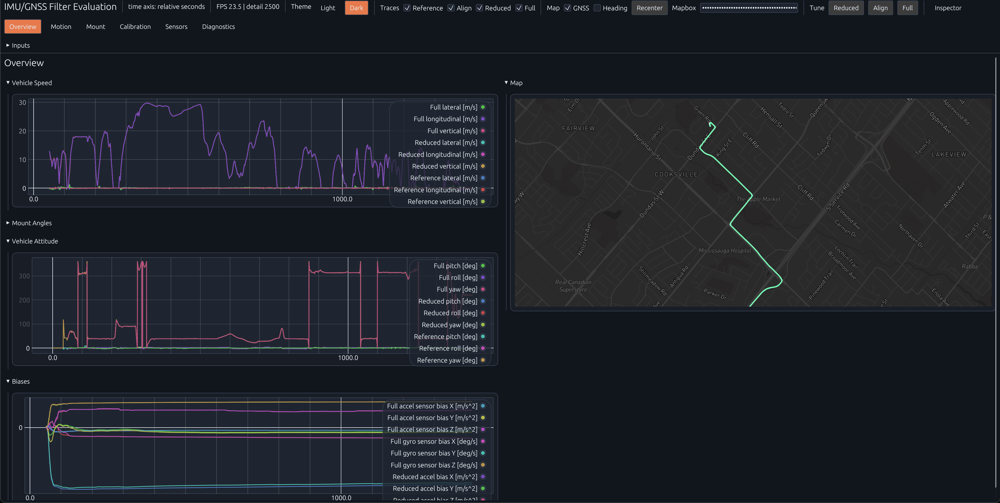

# IMU/GNSS Fusion

[](https://github.com/yongkyuns/imu_gnss_fusion/actions/workflows/ci.yml)
[](LICENSE)
[](https://www.rust-lang.org/)
[](https://yongkyuns.github.io/imu_gnss_fusion/)

🌐 **Hosted web app:** [yongkyuns.github.io/imu_gnss_fusion](https://yongkyuns.github.io/imu_gnss_fusion/)



IMU/GNSS Fusion is a Rust workspace for experimenting with ground-vehicle
inertial/GNSS fusion. It contains an embedded-oriented EKF crate, offline replay
and visualization tools, synthetic trajectory generation, and hardware-agnostic
CSV replay support.

The implementation targets consumer-grade IMUs and GNSS receivers on ground
vehicles, with optional wheel-speed input when available. It is designed to
integrate with standard timestamped IMU and GNSS outputs rather than any
specific receiver, firmware stack, or logger format.

Rust is used because it fits the no-std filter crate, the native simulator, and
the browser visualizer in one workspace. The core algorithms are intentionally
straightforward and use embedded-friendly patterns such as scalar measurement
updates.

The library can be initialized with known vehicle-to-IMU mounting angles, or it
can estimate mounting internally. In automatic mount mode, the runtime waits
until it has enough valid GNSS-backed vehicle motion to produce a usable mount
seed before EKF initialization.

## Quick Start

Try the hosted visualizer first:

- [Open the web demo](https://yongkyuns.github.io/imu_gnss_fusion/)

Requirements for local development:

- Rust stable. The workspace uses Rust 2024 crates.
- Python with `sympy` only when regenerating generated EKF Rust files.

Build and test the workspace:

```bash
cargo build --workspace --locked
cargo test --workspace --locked
```

Run the native visualizer on a generic replay directory:

```bash
cargo run --release -p sim --bin visualizer -- \
  --generic-replay-dir /path/to/replay-dir
```

Run the native visualizer on a synthetic scenario:

```bash
cargo run --release -p sim --bin visualizer -- \
  --synthetic-motion-def sim/motion_profiles/city_blocks_15min.scenario \
  --synthetic-noise low
```

Build and serve the browser visualizer locally:

```bash
cargo build -p sim --bin visualizer --release --target wasm32-unknown-unknown
wasm-bindgen --target web --out-dir web/pkg \
  target/wasm32-unknown-unknown/release/visualizer.wasm
python3 -m http.server --directory web 8080
```

## Documentation

- [docs/README.md](docs/README.md): documentation index.
- [docs/testing.md](docs/testing.md): testing workflow.
- [docs/math/frames.md](docs/math/frames.md): frame and quaternion conventions.
- [docs/math/ekf.md](docs/math/ekf.md): EKF math note index.
- [docs/events.pdf](docs/events.pdf): road event detector math and algorithms.
- [docs/filter-algorithms.md](docs/filter-algorithms.md): EKF runtime behavior.
- [docs/data-and-simulation.md](docs/data-and-simulation.md): replay data and synthetic simulation.
- [docs/visualizer-tools-testing.md](docs/visualizer-tools-testing.md): visualizer, tools, and test workflow.

## Workspace Layout

| Path | Purpose |
| --- | --- |
| `sensor_fusion/` | `sensor_fusion` library crate, EKF runtime, alignment, generated model code, and filter API tests. |
| `sim/` | Replay, simulation, evaluation, diagnostics, and egui visualizer crate. |
| `docs/` | Project documentation, math PDFs/TEX sources, and test guidance. |
| `web/` | Static browser host for the wasm visualizer. |
| `mobile/ios/` | Experimental iOS sensor collection app. |

## Architecture


The editable source for this diagram is [arch.pen](arch.pen). The exported
diagram asset is checked in so the architecture stays visible on GitHub without
requiring Pencil.

Main replay path:

1. Data enters as hardware-agnostic `imu.csv` and `gnss.csv`, or as a synthetic
   scenario generated inside `sim`.
2. `sim::datasets` converts CSV rows into timestamped IMU/GNSS samples.
3. `sim::eval::replay` merges IMU and GNSS events in a consistent time order.
4. `sensor_fusion` runs mount alignment and the EKF.
5. `sim::visualizer` displays traces, map data, mount states, diagnostics, and
   summary statistics.

Generated Rust matrix/Jacobian snippets live under the EKF implementation
modules. Symbolic sources are Python/SymPy files so model derivation stays
reviewable while generated Rust stays fast and dependency-light.

Reference data included with hosted or generic replay datasets is used for
plots, summaries, and tests. It is not a normal runtime input unless manual
mount mode explicitly uses a reference mount.

## Coordinate And API Conventions

The runtime uses active rotations. `C_ab` maps coordinates from frame `b` to
frame `a`:

```text
x_a = C_ab x_b
R(q_ab) = C_ab
R(q1 * q2) = R(q1) R(q2)
```

Quaternions are scalar-first `[w, x, y, z]`.

| Symbol | Meaning |
| --- | --- |
| `b` | Raw IMU body/sensor frame. Public `ImuSample` gyro and accel are expressed here. |
| `v` | Vehicle frame, forward-right-down. Vehicle speed and nonholonomic constraints are expressed here. |
| `n` | Local NED navigation frame used by GNSS velocities and local attitude conventions. |
| `e` | ECEF frame used for WGS84 conversion and global position math. |

The public mount quaternion is `q_bv`, the physical vehicle-to-body mount:

```text
x_b = C_bv x_v
C_vb = C_bv^T
x_v = C_vb x_b
```

Raw IMU samples are not pre-rotated by callers. The EKF rotates body-frame IMU
samples into the vehicle frame internally.

Expected `sensor_fusion` inputs:

| Input | Required convention |
| --- | --- |
| `ImuSample::gyro_radps` | Raw body-frame angular rate `[x_b, y_b, z_b]`, rad/s. |
| `ImuSample::accel_mps2` | Raw body-frame specific force `[x_b, y_b, z_b]`, m/s^2. |
| `GnssSample::lat/lon/height` | WGS84 latitude/longitude degrees and ellipsoidal height meters. |
| `GnssSample::vel_ned_mps` | Local `[north, east, down]` velocity, m/s. |
| `GnssSample::pos_std_m` | One-sigma local NED position standard deviations, meters. |
| `GnssSample::vel_std_mps` | One-sigma local NED velocity standard deviations, m/s. |
| `GnssSample::heading_rad` | Optional vehicle heading in NED, radians clockwise from north toward east. |
| `VehicleSpeedSample` | Nonnegative speed magnitude along vehicle `+X`; direction selects forward/reverse. |

Minimal API example:

```rust
use sensor_fusion::{
    Config, GnssSample, ImuSample, MountMode, SensorFusion,
    VehicleSpeedDirection, VehicleSpeedSample,
};

let mount_q = [1.0, 0.0, 0.0, 0.0]; // q_bv: x_b = R(q_bv) x_v
let mut fusion = SensorFusion::with_config(Config {
    mount_mode: MountMode::Manual(mount_q),
});

fusion.process_imu(ImuSample {
    t_s: 0.00,
    gyro_radps: [0.0, 0.0, 0.0],
    accel_mps2: [0.0, 0.0, -9.80665],
});

fusion.process_gnss(GnssSample {
    t_s: 0.01,
    lat_deg: 37.0,
    lon_deg: -122.0,
    height_m: 10.0,
    vel_ned_mps: [5.0, 0.0, 0.0],
    pos_std_m: [1.0, 1.0, 2.5],
    vel_std_mps: [0.1, 0.1, 0.2],
    heading_rad: Some(0.0),
});

fusion.process_vehicle_speed(VehicleSpeedSample {
    t_s: 0.02,
    speed_mps: 5.0,
    direction: VehicleSpeedDirection::Forward,
});

if let Some(q_bv) = fusion.mount_q_bv() {
    let _ = q_bv;
}
```

## Embedded Benchmark

Current embedded budget notes should be regenerated after runtime changes. The
benchmark harness measures predict-only and update-heavy schedules on an
ESP32-S3-class target and reports linked flash contribution, state-object size,
and CPU budget at the assumed IMU/GNSS rates.

Treat those numbers as budget-level embedded timings rather than
cycle-accurate microbenchmarks, because the timing source on the target reports
at millisecond granularity.

## Filter And Replay Modes

The public `sensor_fusion::MountMode` and visualizer `--misalignment` option
use the same two mount behaviors:

| Mode | Behavior |
| --- | --- |
| `auto` | Align seeds the mount angle; the EKF estimates residual mount states internally. |
| `manual` | Uses a supplied/reference `q_bv` vehicle-to-body mount and freezes mount states. |

See [sim/README.md](sim/README.md) for the current tool map.

## Data Formats

The common hardware-agnostic replay directory contains two required CSV files.

`imu.csv`

```text
t_s,gx_radps,gy_radps,gz_radps,ax_mps2,ay_mps2,az_mps2
```

`gnss.csv`

```text
t_s,lat_deg,lon_deg,height_m,vn_mps,ve_mps,vd_mps,pos_std_n_m,pos_std_e_m,pos_std_d_m,vel_std_n_mps,vel_std_e_mps,vel_std_d_mps,heading_rad
```

`imu.csv` gyro and accel columns are raw body-frame samples. `gnss.csv`
velocity and standard-deviation columns are local NED. `heading_rad` may be
`NaN` when heading is unavailable. Producers include
`export_synthetic_replay_generic`; hardware-specific converters should live
outside this repository and emit this schema.

Replay directories can include optional reference traces used only for
evaluation and visualization:

```text
reference_attitude.csv
reference_mount.csv
reference_position.csv
reference_motion.csv
```

Attitude and mount reference CSVs use `t_s,roll_deg,pitch_deg,yaw_deg`.
Attitude references describe vehicle attitude in the local NED convention.
Mount references describe the physical `q_bv` vehicle-to-body mount. Position
references use
`t_s,lat_deg,lon_deg,height_m,vn_mps,ve_mps,vd_mps,heading_rad`. Motion
references use
`t_s,wx_radps,wy_radps,wz_radps,ax_mps2,ay_mps2,az_mps2`, with vehicle-frame
angular velocity and gravity-compensated linear acceleration.

Package generic replay data for static hosting:

```bash
python3 scripts/package_dataset.py /path/to/replay-dir /tmp/hosted-drive
```

## Generated-Code Workflow

Generated Rust files are checked in. Regenerate EKF model code after changing
the symbolic formulation sources:

```bash
python sensor_fusion/src/ekf/formulation.py --emit-rust
```

After regeneration, review the generated diffs and run targeted tests from
[docs/testing.md](docs/testing.md).

## Tests

Common local checks:

```bash
cargo test -p sensor_fusion --locked
cargo test -p sim --locked
cargo test --workspace --locked
```

See [docs/testing.md](docs/testing.md) for focused test groups, fixtures, and
expensive/local-data notes.

## License

MIT. See [LICENSE](LICENSE).

## References

- [`gnss-ins-sim`](https://github.com/Aceinna/gnss-ins-sim): referenced for synthetic IMU/GNSS data generation concepts.
- [`open-aided-navigation`](https://github.com/fedorbaklanov/open-aided-navigation): referenced for loosely coupled EKF formulation concepts.
