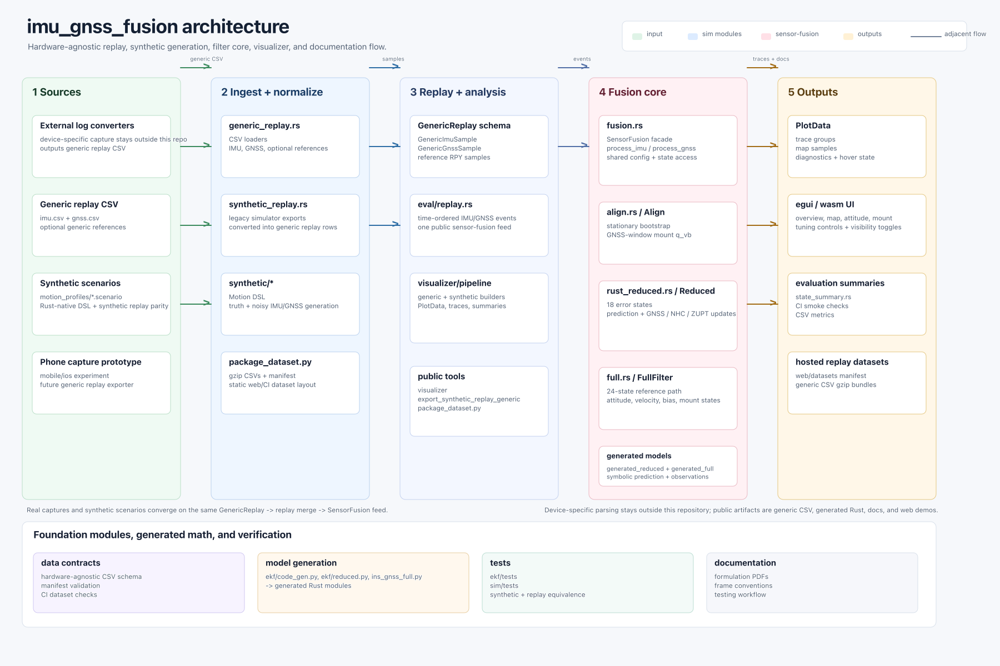

# imu_gnss_fusion

[](https://github.com/yongkyuns/imu_gnss_fusion/actions/workflows/ci.yml)
[](LICENSE)
[](https://www.rust-lang.org/)
[](https://yongkyuns.github.io/imu_gnss_fusion/)

🌐 **Hosted web app:** [yongkyuns.github.io/imu_gnss_fusion](https://yongkyuns.github.io/imu_gnss_fusion/)

`imu_gnss_fusion` is a Rust workspace for experimenting with IMU, GNSS, and wheel-speed sensor fusion. It contains an embedded-oriented filter crate, offline replay and visualization tools, synthetic trajectory generation, and hardware-agnostic CSV replay support.

The project is currently an active filter-development workspace rather than a
finished navigation product. The main work is tuning the standalone alignment
estimator, comparing the two EKF formulations, and using synthetic plus
reference-backed field data to understand accuracy, stability, and convergence
limits.

The project is useful for:

- 📊 replaying hardware-agnostic IMU/GNSS CSV datasets,
- 🧭 comparing Align, Full EKF, and Reduced EKF behavior,
- 🧪 generating synthetic trajectories for repeatable mount-angle experiments,
- ✅ validating generated Kalman-model code against focused Rust tests.

## 🧱 Workspace Layout

| Path | Purpose |
| --- | --- |
| `sensor_fusion/` | `sensor_fusion` library crate. Contains Align, Full EKF, Reduced EKF, generated model code, and filter API tests. |
| `sim/` | Replay, simulation, evaluation, diagnostics, and egui visualizer crate. |
| `docs/` | Project documentation, math PDFs/TEX sources, and test guidance. |
| `web/` | Static browser host for the wasm visualizer. |
| `mobile/ios/` | Experimental iOS sensor collection app. |

## 🧩 Module Overview

The workspace is split so the embedded filter library is independent from
offline tooling and visualization. The core sensor-fusion crate has three
current algorithm modules:

- `align`: a standalone mount-alignment estimator. It is being tuned to improve
  overall stability, seed quality, and downstream filter performance.
- `reduced`: a local-NED reduced-state EKF implementation of the IMU/GNSS
  fusion problem.
- `full`: a full-state ECEF EKF implementation of the same fusion problem.

`reduced` and `full` are intentionally maintained side by side today so their
math, tuning, covariance behavior, and replay accuracy can be compared. They are
two implementations of the same navigation problem, not two separate end-user
products. The intended direction is to consolidate them into a single filter
implementation once the formulation and tuning tradeoffs are understood well
enough.

### `sensor_fusion` crate (`sensor_fusion/src`)

| Module | Role |
| --- | --- |
| `SensorFusion` | Public facade for timestamped IMU, GNSS, and optional vehicle-speed samples. Owns Align, local anchoring, selected EKF initialization, and accessors used by apps. |
| `align` | Standalone mount-alignment estimator from stationary gravity, GNSS-derived motion, turn-rate cues, and NHC-style constraints. Its output can seed the runtime EKF mount states. |
| `reduced` | Local-NED reduced-state EKF implementation. This is one candidate runtime formulation for the same IMU/GNSS fusion problem solved by `full`. |
| `full` | Full-state ECEF EKF implementation. It is used as the parallel formulation for comparison, diagnostics, and eventual consolidation with `reduced`. |
| `math`, `nav`, `covariance`, generated wrappers | Internal reusable quaternion/vector math, WGS84/ECEF helpers, sparse covariance propagation, and generated symbolic model glue. |

Symbolic model sources live next to the Rust crate:

| Path | Role |
| --- | --- |
| `sensor_fusion/src/reduced/formulation.py` | SymPy source for Reduced generated Rust. |
| `sensor_fusion/src/full/formulation.py` | SymPy source for Full generated Rust. |
| `sensor_fusion/code_gen.py` | Shared Python code-generation helpers. |

### `sim` crate (`sim/src`)

| Module | Role |
| --- | --- |
| `datasets` | Generic replay CSV parsers, synthetic replay parsers, and seeded Full fixture loaders. |
| `eval` | Replay ordering, trace lookup helpers, quaternion/math utilities, state summaries, and evaluation config snapshots. |
| `synthetic` | Rust-native motion DSL, trajectory generation, IMU/GNSS noise injection, and synthetic truth/measured sample generation. |
| `visualizer` | Shared native/web visualization model, replay pipelines, map/stat helpers, theme, UI modules, and background replay jobs. |
| `bin/*` | CLI tools for visualization, dataset export, diagnostics, runtime benchmarking, and focused filter investigations. |

The visualizer UI is intentionally modular:

| Module | Role |
| --- | --- |
| `visualizer/ui/controls` | Always-visible top controls, web input selection, trace toggles, and run controls. |
| `visualizer/ui/pages` | Overview, motion, mount, calibration, sensors, and diagnostics page composition. |
| `visualizer/ui/plots` | Reusable plot sections, foldable overview tiles, shared cursor, log axes, and decimation. |
| `visualizer/ui/maps` | Map tile providers, map overlays, markers, arrows, and synthetic local-trajectory drawing. |
| `visualizer/ui/inspector` | Hover-window update allocation and covariance/residual inspector views. |
| `visualizer/ui/tuning` | Align, Reduced, and Full tuning panels. |
| `visualizer/ui/web` | Browser-only manifest loading, drag/drop CSV loading, worker orchestration, and synthetic web inputs. |
| `visualizer/ui/runtime` | App construction, replay refresh, theme initialization, and egui frame update. |
| `visualizer/ui/state`, `trace_query`, `colors`, `orthogonal`, `windows` | Shared UI state, trace sampling/classification, color policy, angle popups, and floating windows. |

See [docs/README.md](docs/README.md) for the complete documentation index and
[sim/README.md](sim/README.md) for the command-line tool map.

## 🗺️ Architecture



The editable source for this diagram is [arch.pen](arch.pen). The exported
screenshot above is checked in so the architecture stays visible on GitHub
without requiring Pencil.

The main replay path is:

1. Data enters as hardware-agnostic `imu.csv` and `gnss.csv`, or as a synthetic scenario generated inside `sim`.
2. `sim::datasets` converts CSV rows into timestamped IMU/GNSS samples.
3. `sim::eval::replay` merges IMU and GNSS events in a consistent time order.
4. `sensor_fusion` runs Align plus the Reduced and Full EKF implementations.
5. `sim::visualizer` displays traces, map data, mount states, diagnostics, and summary statistics.

The runtime Rust filter code consumes generated matrix/Jacobian snippets under `sensor_fusion/src/reduced/generated/` and `sensor_fusion/src/full/generated/`. The symbolic sources live in Python so model derivation stays reviewable while generated Rust stays fast and dependency-light.

Plots, controls, modules, binaries, and generated-code paths consistently use
**Reduced** for the reduced-state local-NED EKF and **Full** for the full-state
ECEF EKF.

Reference data included with hosted/generic replay datasets is used for rough
accuracy comparison in plots, summaries, and tests. It is not an input to the
runtime filters unless the user explicitly selects manual mount mode; otherwise
it only provides an external yardstick for current filter performance.

## 🧭 Coordinate And API Conventions

The filters use active rotations: `x_a = C_ab x_b`, and quaternion products
compose as `C(q1 * q2) = C(q1) C(q2)`. Quaternions are scalar-first
`[w, x, y, z]`.

| Symbol | Meaning |
| --- | --- |
| `b` | Raw IMU body/sensor frame. Public `ImuSample` gyro and accel are expressed here. |
| `v` | Vehicle frame, forward-right-down. Vehicle speed and non-holonomic constraints are expressed here. |
| `n` | Local NED navigation frame used by Reduced and GNSS velocities. |
| `e` | ECEF frame used internally by Full. |

The current implementation follows the mount-in-propagation convention used by
Full. The mount quaternion returned by Align and stored in the `qcs0..qcs3`
fields of both filters is the physical vehicle-to-body mount:

```text
x_b = C_bv(q_mount) x_v
x_v = C_bv(q_mount)^T x_b
```

Raw IMU samples are not pre-rotated by callers. Reduced and Full rotate them
into the vehicle frame inside propagation. Reduced attitude `q0..q3` is the
vehicle-to-NED quaternion `q_nv`; Full attitude `q0..q3` is the vehicle-to-ECEF
quaternion `q_ev`. NHC velocity is `C_nv^T v_n` for Reduced and `C_ev^T v_e`
for Full.

Expected `sensor_fusion` inputs:

| Input | Required convention |
| --- | --- |
| `ImuSample::gyro_radps` | Raw body-frame angular rate `[x_b, y_b, z_b]`, rad/s. |
| `ImuSample::accel_mps2` | Raw body-frame specific force `[x_b, y_b, z_b]`, m/s². |
| `GnssSample::lat/lon/height` | WGS84 latitude/longitude degrees and ellipsoidal height meters. |
| `GnssSample::vel_ned_mps` | Local `[north, east, down]` velocity, m/s. |
| `GnssSample::pos_std_m` | One-sigma local NED position standard deviations, meters. |
| `GnssSample::vel_std_mps` | One-sigma local NED velocity standard deviations, m/s. |
| `GnssSample::heading_rad` | Optional vehicle heading in NED, radians clockwise from north toward east. |
| `VehicleSpeedSample` | Nonnegative speed magnitude along vehicle `+X`; direction selects forward/reverse. |

Minimal `sensor_fusion` API example:

```rust
use sensor_fusion::{
    Config, Filter, GnssSample, ImuSample, MountMode, SensorFusion,
    VehicleSpeedDirection, VehicleSpeedSample,
};

let mount_q = [1.0, 0.0, 0.0, 0.0]; // x_b = C_bv(q) x_v
let mut fusion = SensorFusion::with_config(Config {
    filter: Filter::Reduced,
    mount_mode: MountMode::Manual(mount_q),
    ..Config::default()
});

fusion.process_imu(ImuSample {
    t_s: 0.00,
    gyro_radps: [0.0, 0.0, 0.0],
    accel_mps2: [0.0, 0.0, -9.80665],
});

fusion.process_gnss(GnssSample {
    t_s: 0.01,
    lat_deg: 37.0,
    lon_deg: -122.0,
    height_m: 10.0,
    vel_ned_mps: [5.0, 0.0, 0.0],
    pos_std_m: [1.0, 1.0, 2.5],
    vel_std_mps: [0.1, 0.1, 0.2],
    heading_rad: Some(0.0),
});

fusion.process_vehicle_speed(VehicleSpeedSample {
    t_s: 0.02,
    speed_mps: 5.0,
    direction: VehicleSpeedDirection::Forward,
});

if let Some(reduced) = fusion.reduced() {
    let vn = reduced.nominal.vn;
    let mount_q = [
        reduced.nominal.qcs0,
        reduced.nominal.qcs1,
        reduced.nominal.qcs2,
        reduced.nominal.qcs3,
    ];
    let _ = (vn, mount_q);
}
```

## 📈 Embedded Benchmark

Reduced and full filter timing was measured on an ESP32-S3 at 240 MHz using the
`rustcam/apps/fusion_bench` harness and this workspace's current
`sensor_fusion` crate. The benchmark uses 200 warmup iterations, then measures
2000 predict-only iterations and 1000 measurement-update iterations. The budget
model assumes 100 Hz IMU and 2 Hz GNSS, or 98 IMU+NHC steps/s plus 2
IMU+GNSS+NHC steps/s.

Release build settings:

| Setting | Value |
|---|---|
| Rust profile | `release` |
| Optimization | `opt-level = "z"` |
| LTO | `fat` |
| Codegen units | `1` |
| Panic strategy | `abort` |
| Symbols / debug | stripped symbols, debug disabled |
| Checks | overflow checks and debug assertions disabled |

Runtime speed:

| Operation | Reduced | Full |
|---|---:|---:|
| Predict only | 595 us | 895 us |
| IMU + NHC step | 1500 us | 1720 us |
| IMU + GNSS + NHC step | 2320 us | 3740 us |
| 100 Hz IMU / 2 Hz GNSS budget | 151.640 ms/s | 176.040 ms/s |
| CPU budget at 240 MHz | 15.164% | 17.604% |
| Average per 10 ms IMU tick | 1516.4 us | 1760.4 us |

The CPU budget is computed from the steady-state sensor schedule:

```text
Reduced = 98 * 1500 us + 2 * 2320 us = 151.640 ms/s
Full    = 98 * 1720 us + 2 * 3740 us = 176.040 ms/s
```

The linked `sensor_fusion` footprint was decoded from the benchmark firmware
using `rust-nm -S --demangle` and the linker map. This counts symbols and
allocated sections belonging to the `sensor_fusion` object, not the operating
system, benchmark harness, standard library, or logging code.

| Footprint item | Size |
|---|---:|
| Decoded function symbols | 36.7 kB |
| Allocated text + Xtensa literal pools | 38.6 kB |
| Read-only data/constants | 3.0 kB |
| Total linked flash contribution | 41.6 kB |
| Static `.data` / `.bss` RAM | 0.0 kB |

The main linked-code split is approximately 17.0 kB for reduced, 19.7 kB for
full, and 1.8 kB for shared math/navigation/covariance helpers, with the
remaining bytes in read-only constants and compiler-generated helpers. The
benchmark image links both reduced and full; applications that link only one
filter can be smaller after LTO and section garbage collection.

Runtime state is owned by the caller, so it is not represented as static RAM in
the symbol table. Current compiler type layout for the persistent state objects:

| Runtime object | Size |
|---|---:|
| `reduced::Filter` | 3.8 kB |
| `full::Filter` | 3.5 kB |
| `align::Align` | 0.4 kB |
| `SensorFusion` facade, owning align + reduced + full | 8.8 kB |

The timing source on this NuttX setup reports at millisecond granularity, so
these numbers should be treated as budget-level embedded timings rather than
cycle-accurate microbenchmarks.

## 🚀 Quick Start

Requirements:

- Rust stable. The workspace uses Rust 2024 crates.
- Python with `sympy` is only needed when regenerating Kalman-model Rust files.

Build and test the main workspace:

```bash
cargo build --workspace --locked
cargo test --workspace --locked
```

Run the visualizer on a generic replay directory:

```bash
cargo run --release -p sim --bin visualizer -- \
  --generic-replay-dir /path/to/replay-dir
```

Run the visualizer on a synthetic scenario:

```bash
cargo run --release -p sim --bin visualizer -- \
  --synthetic-motion-def sim/motion_profiles/city_blocks_15min.scenario \
  --synthetic-noise low
```

Build the browser visualizer:

```bash
cargo build -p sim --bin visualizer --release --target wasm32-unknown-unknown
wasm-bindgen --target web --out-dir web/pkg \
  target/wasm32-unknown-unknown/release/visualizer.wasm
python3 -m http.server --directory web 8080
```

## 🎛️ Filter And Replay Modes

The public `sensor_fusion::MountMode` and visualizer `--misalignment` option
use the same two mount behaviors:

| Mode | Behavior |
| --- | --- |
| `auto` | Align seeds the mount angle; Reduced/Full then estimate the physical mount states internally. |
| `manual` | Uses a supplied/reference vehicle-to-body mount and freezes mount states in Reduced/Full. |

See [sim/README.md](sim/README.md) for the current tool map.

## 📦 Data Formats

The common hardware-agnostic replay directory contains two required CSV files:

`imu.csv`

```text
t_s,gx_radps,gy_radps,gz_radps,ax_mps2,ay_mps2,az_mps2
```

`gnss.csv`

```text
t_s,lat_deg,lon_deg,height_m,vn_mps,ve_mps,vd_mps,pos_std_n_m,pos_std_e_m,pos_std_d_m,vel_std_n_mps,vel_std_e_mps,vel_std_d_mps,heading_rad
```

`imu.csv` gyro and accel columns are raw body-frame samples. `gnss.csv`
velocity and standard-deviation columns are local NED. `heading_rad` may be
`NaN` when heading is unavailable. Producers include
`export_synthetic_replay_generic`; hardware-specific converters should live
outside this repository and emit this schema.

Replay directories can also include optional reference traces used only for evaluation and visualization:

```text
reference_attitude.csv
reference_mount.csv
reference_position.csv
```

Attitude and mount reference CSVs use `t_s,roll_deg,pitch_deg,yaw_deg`.
Attitude references describe vehicle attitude in the local NED convention.
Mount references describe the physical vehicle-to-body mount. Position
references use
`t_s,lat_deg,lon_deg,height_m,vn_mps,ve_mps,vd_mps,heading_rad`. They are
intentionally generic: a converter may derive them from any trusted reference
system, but this repository does not depend on the reference device protocol.

Example conversions:

```bash
cargo run --release -p sim --bin export_synthetic_replay_generic -- \
  /path/to/synthetic-export/output /tmp/replay \
  --signal-source meas
```

Package generic replay data for static hosting:

```bash
python3 scripts/package_dataset.py /path/to/replay-dir /tmp/hosted-drive
```

The hosted dataset layout is:

```text
manifest.json
imu.csv.gz
gnss.csv.gz
reference_position.csv.gz  # optional
reference_attitude.csv.gz  # optional
reference_mount.csv.gz     # optional
```

`scripts/package_dataset.py` can stage an existing generic replay directory or call `export_synthetic_replay_generic` for synthetic-export output. Raw `.bin` logs are intentionally not supported in this repository because device-specific parsing belongs outside the hardware-agnostic replay boundary.

## ⚙️ Generated-Code Workflow

Generated Rust files are checked in and included by the generated wrappers in `sensor_fusion/src/reduced/generated.rs` and `sensor_fusion/src/full/generated.rs`.

Regenerate Reduced EKF model code after changing `sensor_fusion/src/reduced/formulation.py`:

```bash
python sensor_fusion/src/reduced/formulation.py --emit-rust
```

Regenerate Full EKF model code after changing `sensor_fusion/src/full/formulation.py`:

```bash
python sensor_fusion/src/full/formulation.py --emit-rust
```

After regeneration, review the generated diffs and run targeted tests from [docs/testing.md](docs/testing.md).

## ✅ Tests

Common local checks:

```bash
cargo test -p sensor_fusion --locked
cargo test -p sim --locked
cargo test --workspace --locked
```

See [docs/testing.md](docs/testing.md) for focused test groups, fixtures, and expensive/local-data notes.

## 📚 Documentation

- [docs/README.md](docs/README.md): documentation index.
- [docs/testing.md](docs/testing.md): testing workflow.
- [docs/math/frames.md](docs/math/frames.md): frame and quaternion conventions.
- [docs/math/full.md](docs/math/full.md): Full EKF operational links.
- [docs/reduced.pdf](docs/reduced.pdf): detailed Reduced EKF mount formulation.
- [docs/align.pdf](docs/align.pdf): detailed Align/NHC formulation.
- [docs/full.pdf](docs/full.pdf): detailed Full EKF formulation.

## 📄 License

MIT. See [LICENSE](LICENSE).

## 🙏 References

This project references `gnss-ins-sim` for synthetic IMU/GNSS data generation concepts and `open-aided-navigation` for loosely coupled Full EKF formulation concepts. These projects are references only; this repository does not vendor or depend on their source code.
