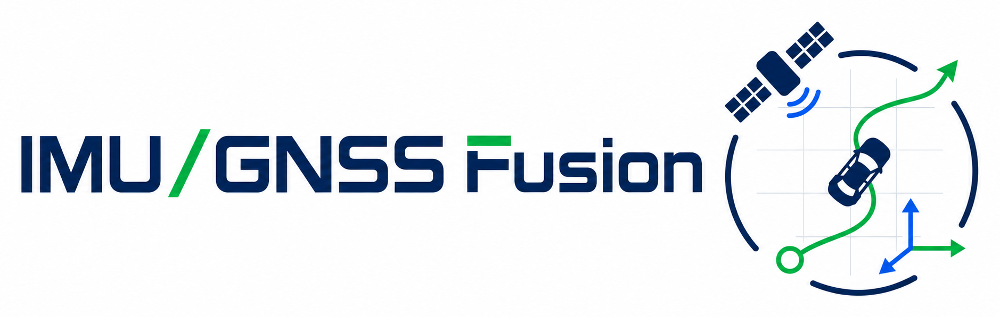
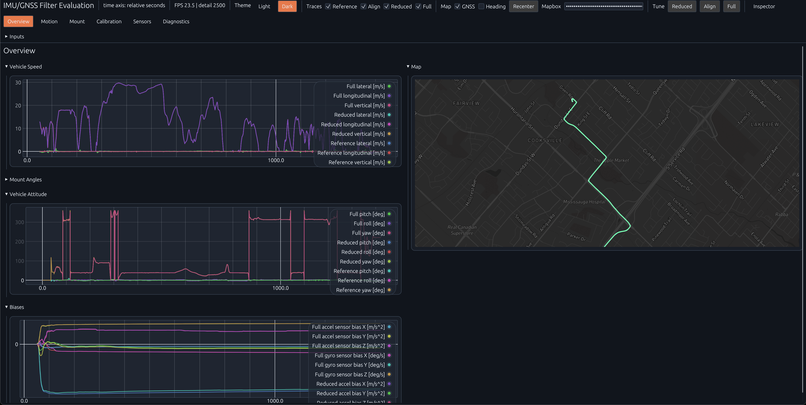

<p align="center">
  
</p>

<p align="center">
  <a href="https://github.com/yongkyuns/imu_gnss_fusion/actions/workflows/ci.yml"></a>
  <a href="LICENSE"></a>
  <a href="https://www.rust-lang.org/"></a>
  <a href="https://yongkyuns.github.io/imu_gnss_fusion/"></a>
</p>

IMU/GNSS Fusion is a Rust workspace for ground-vehicle inertial/GNSS navigation experiments. It contains an embedded-oriented fusion runtime, replay and simulation tools, synthetic trajectory generation, a browser visualizer, a `road_events` detector crate, and an iOS data-collection app.

- Web visualizer: [yongkyuns.github.io/imu_gnss_fusion](https://yongkyuns.github.io/imu_gnss_fusion/)
- Documentation: [yongkyuns.github.io/imu_gnss_fusion/docs](https://yongkyuns.github.io/imu_gnss_fusion/docs/)



## Quick Start

```bash
cargo build --workspace --locked
cargo test --workspace --locked
```

Run the native visualizer on a generic replay directory:

```bash
cargo run --release -p sim --bin visualizer -- \
  --generic-replay-dir /path/to/replay-dir
```

Run the native visualizer on a synthetic scenario:

```bash
cargo run --release -p sim --bin visualizer -- \
  --synthetic-motion-def sim/motion_profiles/city_blocks_15min.scenario \
  --synthetic-noise low
```

Build and serve the browser visualizer locally:

```bash
cargo build -p sim --bin visualizer --release --target wasm32-unknown-unknown --locked
wasm-bindgen --target web --out-dir web/pkg \
  target/wasm32-unknown-unknown/release/visualizer.wasm
python3 -m http.server --directory web 8080
```

Build the documentation site:

```bash
python -m pip install -r docs/requirements.txt
sphinx-build -W --keep-going -b html docs target/docs-html
```

## Workspace

| Path | Purpose |
| --- | --- |
| `sensor_fusion/` | no-std fusion library, high-level `SensorFusion` facade, alignment estimator, EKF runtime, and tests |
| `road_events/` | no-std streaming road-event detectors and trip statistics |
| `sim/` | replay, simulation, diagnostics, synthetic generation, native/wasm visualizer |
| `web/` | static browser host for the wasm visualizer and hosted datasets |
| `mobile/ios/` | iOS app, Rust FFI wrapper, recording/export tools |
| `docs/` | Sphinx source, integrated math notes, and documentation assets |

See the [documentation site](https://yongkyuns.github.io/imu_gnss_fusion/docs/) for API conventions, EKF/alignment details, road events, hosted datasets, iOS workflows, CI, and benchmark notes.
