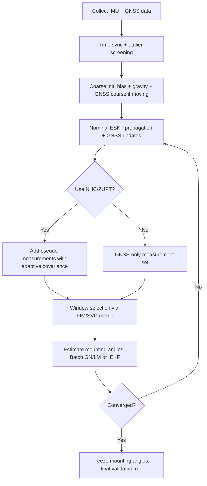

# Estimating IMU Mounting Misalignment Angles in Ground Vehicles Using Only IMU and GNSS Data

## Executive summary

This report addresses rapid (≲5 minutes) estimation of **IMU mounting misalignment angles** (also called *mounting angles*, *boresight*, or *installation angles*) for a ground vehicle INS/GNSS fusion system **using only IMU and GNSS data**, with no reliance on wheelbase, wheel speeds, steering angle, or other vehicle sensors (unless explicitly added later). The core problem is a **static extrinsic rotation** between the IMU body frame and a vehicle (or motion) frame that is required when applying vehicle-motion constraints (e.g., nonholonomic constraints) and for consistent interpretation of IMU-derived dynamics in vehicle coordinates. Nonholonomic constraints (NHC) are widely used because they encode the physical fact that a wheeled vehicle typically has near-zero **lateral and vertical velocity in the vehicle frame** (absent sideslip or “jumping”), and improve attitude/position performance when GNSS is degraded; these constraints are also a major lever to make certain angles observable quickly. citeturn9view0turn5search7

Across the requested method families, the main conclusions are:

A fast, high-accuracy approach is typically **two-stage**: (i) a robust **coarse initialization** (gravity + GNSS course/velocity) followed by (ii) a **refinement estimator** (batch LS / iterated EKF / fixed-lag smoothing) over a carefully chosen excitation segment that maximizes information for the mounting angles. The refinement step should explicitly model lever arms and biases because observability and accuracy are strongly coupled to them. citeturn31view0turn22view2turn9view0

For <5 minute identification, **excitation design matters as much as the estimator**. Straight-line motion with small speed variation tends to produce weak observability for yaw-related quantities; changes in acceleration and angular rate are what drive observability improvements for attitude, gyro bias, and lever-arm related modes. citeturn9view0turn31view0

Among estimators, **batch nonlinear least squares / maximum likelihood** (solved by Gauss–Newton / Levenberg–Marquardt) gives the cleanest “what is identifiable” picture via the Fisher information matrix (FIM) and is often the strongest choice for a dedicated, short calibration run. Error-state EKF/IEKF variants are effective online and can be interpreted as incremental least squares; iterated updates (IEKF / IterIEKF) are particularly valuable when GNSS is accurate and measurement nonlinearities matter. citeturn12view0turn28view0turn30view0

Smoothing (RTS / fixed-lag smoothing) improves parameter accuracy because it uses information from both past and future data in the window. Many practical mounting-parameter methods explicitly recommend smoothing the GNSS/INS solution before estimating mounting parameters, especially for low-end IMUs. citeturn20view0turn21view0turn12view2

A key practical constraint: lever arms must be handled carefully. Vendor guidance emphasizes that lever arm accuracy directly impacts GNSS/INS PVA outputs and that lever arm uncertainty should be reflected realistically in the estimator tuning. citeturn22view2turn22view0

Unspecified items such as vehicle speed range, GNSS update rate, GNSS modality (position-only vs Doppler velocity vs raw), road slope, and IMU grade are treated as open-ended; where relevant, this report uses explicit threshold parameters and provides design rules rather than fixed numbers.

## Problem definition and assumptions

### Frames, angles, and what is being calibrated

Let:

* **b-frame**: IMU body/sensor frame (as axes are printed on the IMU).
* **v-frame**: vehicle frame (forward-right-down convention is common in land navigation literature; the precise convention must be fixed in software).
* **n-frame**: local navigation frame (typically NED or ENU; both are used in practice; here we assume NED for formulas, but the structure is identical).

The **mounting misalignment** is a constant rotation \(R_{vb}\in SO(3)\) (or \(R_{bv}=R_{vb}^\top\)) mapping vectors between IMU and vehicle frames. Many works parameterize this by small Euler/Tait–Bryan angles \((\Delta\phi,\Delta\theta,\Delta\psi)\) (roll, pitch, yaw mounting) under the assumption that installation errors are usually a few degrees. citeturn21view0turn17view1

The estimation target is typically:
\[
\theta \;\triangleq\; 
\begin{bmatrix}
\Delta\phi & \Delta\theta & \Delta\psi
\end{bmatrix}^\top
\quad \text{or} \quad
\delta\theta\in\mathbb{R}^3 \text{ in } \mathfrak{so}(3)\;,
\]
optionally augmented with lever arm and bias parameters.

### Inputs and outputs available

Assume only:

* IMU: \( \omega_{m}(t)\) (gyro), \( f_{m}(t)\) (accelerometer), sampled at \(f_{\text{IMU}}\).
* GNSS: at discrete epochs \(t_k\), a position \(p^{n}_{\text{GNSS}}(t_k)\) and/or velocity \(v^{n}_{\text{GNSS}}(t_k)\), with known (or assumed) covariances \(R_p, R_v\).

No odometer, wheel speed, wheelbase, steering angle, or map constraints are assumed (unless explicitly introduced as optional extensions).

### Explicit kinematic constraints and ground-vehicle motion assumptions

The following are *candidate constraints*—you choose which to exploit. If a constraint is not valid in your environment, you should not apply it (or apply it with a large uncertainty / adaptive gating).

**Nonholonomic constraint (NHC)** (most common, optional but powerful): Unless the vehicle jumps or slides, velocity components **lateral** and **vertical** in the vehicle frame are approximately zero:
\[
v_y^v \approx 0,\qquad v_z^v \approx 0.
\]
This is often treated as a pseudo-measurement (virtual measurement) in an INS/GNSS filter. citeturn9view0turn8search11

**Stationary / zero-velocity update (ZUPT/ZVU)** (optional): When the vehicle is detected as stationary, velocity is approximately zero and can be used to constrain states and biases. Vendor tools and many navigation designs use ZUPTs when stationary. citeturn8search3turn8search15

**No “specific constraint” on wheelbase or steering model**: Since wheelbase is unspecified, we do **not** assume a bicycle model, a known yaw rate from steering, or a known relationship between yaw rate and forward speed.

**Straight-line segments**: Often assumed for some closed-form or simplified estimators (e.g., ignore turn-induced lever-arm effects in certain velocity relations). This assumption must be detected and gated (e.g., small yaw rate magnitude). The risk is bias if “straight-line” is incorrectly detected. citeturn17view1turn9view0

**Validity caveats**: NHC can be violated by sustained sideslip (ice, gravel), aggressive manoeuvres, potholes/bumps, banked roads causing transient body-frame vertical velocity, or articulated vehicles. These should be handled by adaptive covariance inflation, residual gating, or segment exclusion. citeturn9view0turn6search14

## Modelling and parameterization

### Strapdown state model and error-state structure

A standard INS state (at the IMU origin) includes position \(p^n\), velocity \(v^n\), and attitude \(R_{nb}\) (or quaternion \(q_{nb}\)), driven by IMU measurements and corrected by GNSS. Introductory strapdown modelling and error propagation for IMUs (biases, noise) are covered in classical notes such as Woodman’s inertial navigation tutorial. citeturn11view0

A practical **error-state** (ESKF) model uses a nominal attitude \(q_{nb}\) plus a small 3‑vector attitude error \(\delta\phi\), rather than estimating quaternion components directly; this mitigates quaternion constraints and is standard in aerospace navigation filtering practice. citeturn9view4turn9view5

### Mounting angle parameterizations: Euler vs quaternion vs Lie algebra

**Euler/Tait–Bryan angles**  
Pros: minimal (3 parameters), intuitive.  
Cons: singularities (gimbal lock), order dependence, and linearization can be fragile if angles are not small. citeturn9view4

**Quaternion parameterization**  
Pros: globally nonsingular representation for attitude; widely used in Kalman filtering with separate 3‑parameter error representation. citeturn9view4turn9view5  
Cons: unit-norm constraint; but handled cleanly in ESKF formulations. citeturn9view4turn9view5

**Lie algebra / small-angle \(\delta\theta\in\mathbb{R}^3\)**  
For a constant mounting rotation \(R_{vb}\), a strong practical choice is:
\[
R_{vb}(\delta\theta) \;=\; \exp([\delta\theta]_\times)\,R_{vb,0}
\]
with \(R_{vb,0}\) initial guess (often identity). This matches manifold EKF / IEKF formulations in robotics and navigation. citeturn9view5turn28view0

### Lever arm modelling for GNSS/INS fusion

Let \( \ell^b \) be the lever arm vector from IMU origin to GNSS antenna phase center, expressed in the IMU body frame.

Rigid-body kinematics gives the velocity at a point offset by \(r\) from a reference point:
\[
v_P = v_O + \omega \times r.
\]
This is the fundamental lever-arm effect in GNSS/INS velocity modelling. citeturn12view3

Thus, in a local navigation frame:
\[
p^n_{\text{GNSS}} = p^n_{\text{IMU}} + R_{nb}\,\ell^b + n_p,
\]
\[
v^n_{\text{GNSS}} = v^n_{\text{IMU}} + R_{nb}\left(\omega^b \times \ell^b\right) + n_v,
\]
where \(\omega^b\) is the body angular rate (bias-corrected in a refined model), and \(n_p,n_v\) are GNSS measurement noises. Lever-arm compensation and its inclusion in measurement models are standard topics in integrated navigation. citeturn12view3turn9view3turn17view2

Vendor documentation emphasizes that lever-arm measurement accuracy affects overall INS PVA accuracy and that lever-arm uncertainty should be realistically entered/tuned in the fusion algorithm. citeturn22view2

### Vehicle motion constraint measurement model (NHC)

Define vehicle-frame velocity at the chosen constraint point:
\[
v^v = R_{vb}\,R_{bn}\,v^n \quad (\text{IMU origin, if constraint point is IMU}).
\]
Then the NHC pseudo-measurement is:
\[
z_{\text{NHC}} \;=\;
\begin{bmatrix} 0\\0 \end{bmatrix}
=
\begin{bmatrix}
v_y^v\\ v_z^v
\end{bmatrix}
+ n_{\text{NHC}},
\]
where \(n_{\text{NHC}}\) represents constraint violation and modelling errors, typically tuned larger than pure sensor noise. citeturn9view0turn8search11

A key nuance: NHC is **point-dependent** on a rotating vehicle; if your constraint point is not collocated with the IMU, you must account for that lever arm. A dedicated study shows NHC effectiveness depends critically on lever arm compensation and gives guidance that forward lever-arm errors are especially influential and should be controlled within sub-decimetre levels to maintain reliable NHC aiding during GNSS outages. citeturn9view2

### Cost functions and Jacobians

#### Batch weighted nonlinear least squares / ML objective

Assuming Gaussian noises and independent measurements, the negative log-likelihood (up to constants) is a weighted least squares cost:
\[
J(\Theta)=\sum_{k}
\|r_p(t_k;\Theta)\|_{R_p^{-1}}^2
+\sum_{k}\|r_v(t_k;\Theta)\|_{R_v^{-1}}^2
+\sum_{k}\|r_{\text{NHC}}(t_k;\Theta)\|_{R_{\text{NHC}}^{-1}}^2,
\]
where \(\Theta\) groups states and parameters (including mounting angles) and \(r_\cdot\) are residuals (predicted – measured). This formulation is standard in least squares and Bayesian estimation perspectives. citeturn12view2turn12view0

#### Jacobian structure for small-angle mounting perturbations

Using the first-order approximation:
\[
R(\delta\theta) \approx (I - [\delta\theta]_\times)\,R_0,
\]
the derivative of a rotated vector \(R(\delta\theta)\,a\) w.r.t. \(\delta\theta\) is:
\[
\frac{\partial (R\,a)}{\partial \delta\theta}
\approx -[R_0 a]_\times.
\]
This is consistent with common small-angle / exponential-map perturbation treatments used in ESKF and manifold filtering. citeturn9view5turn28view0

Applied to the NHC residual \(r_{\text{NHC}} = [v_y^v, v_z^v]^\top\), with \(v^v = R_{vb} R_{bn} v^n\), the Jacobian w.r.t. mounting perturbation \(\delta\theta_{vb}\) is approximately:
\[
H_{\theta}(t_k)\;\triangleq\;
\frac{\partial v^v}{\partial \delta\theta_{vb}}
\approx -\big[\,R_{vb,0}\,R_{bn}(t_k)\,v^n(t_k)\,\big]_\times,
\]
then take rows corresponding to \(y,z\). This Jacobian is the primary ingredient for Fisher information / observability strength computations.

## Estimation methods and comparison

This section compares the requested method families, focusing on rapid identification from short data (minutes).

### Batch least squares and maximum likelihood

**Core idea**: solve for mounting angles (and optionally biases/lever arm) by minimizing the batch residual cost \(J(\Theta)\) over a short window, using Gauss–Newton or Levenberg–Marquardt.

Strengths:
* Directly yields the **Fisher information** (via Jacobians) and CRLB-style benchmarks for the parameters.
* Very strong in short calibration runs because it can use all samples simultaneously.
* Easy to incorporate constraints and robust loss functions (Huber/Cauchy) for NHC violations and GNSS outliers.

Weaknesses:
* Requires storing the window and solving a nonlinear optimization; still feasible for minutes of data on typical embedded CPUs if the parameter set is small and you use sparse/structured solvers.

Connection to incremental filtering: EKF-style methods can be viewed as incremental approximations to Gauss–Newton / least squares updates in certain regimes. citeturn12view0

### Extended and iterated Kalman filters

**EKF / ESKF**: propagate INS with IMU, update with GNSS (and optionally NHC pseudo-measurements), augmenting state with mounting angles as (nearly) constant parameters modeled as random walk with small process noise.

**Iterated EKF (IEKF)**: replaces the one-shot EKF update with iterative relinearization in the update step, explicitly solving a weighted least squares problem iteratively (Gauss–Newton style) until a termination threshold is met. citeturn28view0

Iterated variants (including invariant iterated filters) formally leverage Gauss–Newton-based relinearization and can significantly improve accuracy in low-noise measurement regimes; they can remain viable for real time if only a few iterations are needed. citeturn30view0

Practical implications for mounting-angle calibration:
* Plain EKF is often adequate when GNSS is moderately noisy and angles are small.
* IEKF/IterIEKF helps when GNSS is high accuracy (e.g., RTK) and the measurement model nonlinearity (lever arm + attitude coupling) is significant. citeturn30view0turn22view2

### Smoothing (RTS and fixed-lag)

**Fixed-interval smoothing** (e.g., RTS) improves estimates by using measurements from the entire interval; many pipelines treat smoothing as optional post-processing but beneficial for low-end systems. citeturn21view0turn12view2

In mounting-parameter contexts, a representative IEEE Transactions on Industrial Electronics manuscript explicitly notes using **smoothed integrated results** to ensure estimation accuracy for low-end systems. citeturn20view0

For rapid (<5 min) identification with near-real-time needs, a **fixed-lag smoother** (e.g., 10–60 s lag) is a practical compromise: it provides some “future data” benefit without full batch latency. The estimator must still be robust to GNSS outages within the lag window.

### Maximum likelihood with EM

For linear-Gaussian state-space models, parameters in dynamics/measurement matrices can be estimated via the **EM algorithm**, using a smoothing E-step and a closed-form M-step for many parameters. citeturn16view0

For mounting angles, the system is typically nonlinear, but the conceptual approach still applies:
* E-step: compute smoothed state distributions given current parameter guesses.
* M-step: update mounting parameters by minimizing expected negative log-likelihood (often becomes a weighted least squares step if linearized).

EM is attractive when you want principled ML estimation of noise covariances and parameters, but for <5 minute calibration it can be heavier than direct Gauss–Newton unless carefully engineered.

### Closed-form and quasi-closed-form mounting alignment

Two practically relevant “closed-form-ish” families exist:

**Velocity-vector based quaternion attitude determination**: An accepted IEEE TIE manuscript proposes a quaternion-optimization scheme using **velocity vector observations** and reports very fast estimation speed (≈5 s in their experiments) while avoiding dependence on a delicate initial guess; they use subsequent weighted recursive least squares for lever-arm estimation. citeturn20view0

**Dead-reckoning (DR) aided mounting estimation**: A method for estimating pitch and heading mounting angles uses a two-phase approach (GNSS/INS fusion possibly with smoothing, then a dedicated estimator), and reports fast convergence over a “small piece” of trajectory; it also highlights that certain angles (e.g., roll mounting) may be unobservable under the chosen model/excitation. citeturn21view0

These closed-form-ish methods often still depend on having (or computing) a reasonably good integrated attitude/velocity solution—which is permissible here because it is derived from the same IMU+GNSS data.

### Method comparison table

| Method family | Typical accuracy potential (given good excitation) | Convergence time | Compute cost | GNSS outage robustness | Sensitivity highlights |
|---|---|---|---|---|---|
| Batch weighted LS / ML (Gauss–Newton/LM) | High; often near best achievable for the window if model/noise are correct; supports FIM/CRLB checks citeturn12view2turn4search29 | Fast if window is informative; can converge in tens of seconds of data, but sensitive to excitation | Medium (solve nonlinear system) | Medium: requires GNSS during the informative parts; can bridge short gaps with IMU but parameter observability drops | Sensitive to modelling errors (lever arm, time sync); can add robust losses |
| EKF/ESKF augmented with mounting angles | Medium–high; online, causal; incremental LS interpretation citeturn12view0 | Typically 1–5 min depending on manoeuvres and tuning | Low | Medium: degrades with GNSS gaps; with constraints (NHC/ZUPT) can mitigate | Sensitive to linearization, tuning, and unmodelled biases |
| IEKF / Iterated update filters | Higher than EKF when measurements are accurate/nonlinear; update solves iterative WLS citeturn28view0turn30view0 | Similar data needs to EKF but can reduce “extra time” caused by linearization error | Medium (few iterations per update) | Medium | More robust to strong nonlinearity; still needs good gating |
| RTS / fixed-lag smoothing | Higher than filtering because it uses more information across time; widely recommended as post-processing for better estimates citeturn21view0turn20view0turn12view2 | Needs window completion (fixed-lag reduces latency) | Medium–high (forward + backward pass) | Low–medium: if GNSS outages dominate the window, smoothing can’t invent information | Helps stabilize low-end systems; depends on correct stochastic modelling |
| ML via EM (with smoothing) | High in linear-Gaussian regimes; principled parameter/noise estimation citeturn16view0 | Often slower due to multiple EM iterations | High | Medium | Can estimate covariances but can be slow/fragile in nonlinear settings |
| Closed-form / quaternion velocity-vector alignment | Potentially very fast; reported ≈5 s for a velocity-vector quaternion method in one study citeturn20view0 | Seconds to tens of seconds if assumptions satisfied | Low–medium | Low: typically needs clean GNSS velocity and excitation in the segment | Sensitive to GNSS velocity quality and heading/attitude errors; often best as initializer |

## Observability and excitation design

### Observability drivers in GNSS/INS with mounting/lever arms

Observability in integrated navigation is strongly trajectory-dependent. A control-theoretic observability analysis for GPS/INS error states shows that uncertainties in attitude, gyro bias, and GPS antenna lever arm can create unobservable modes in position/velocity/accelerometer bias, and that **manoeuvring** is what makes the full set observable. It specifically notes:
* changes in acceleration improve estimates of attitude and gyro bias,
* changes in angular velocity enhance lever-arm estimates,
* translation-only or constant angular velocity can be insufficient for lever-arm estimation. citeturn31view0

For land vehicles, long periods of straight driving often lead to weak yaw observability; this motivates adding motion constraints like NHC. citeturn9view0

### Fisher information and singular-value “degree of observability”

For a parameter vector \(\theta\) (e.g., mounting angles) estimated from residuals \(r_k(\theta)\) with covariance \(R_k\), the (approximate) Fisher information matrix for the window is:
\[
\mathcal{I}(\theta)\;\approx\;\sum_{k} 
H_k^\top R_k^{-1} H_k,
\qquad H_k=\frac{\partial r_k}{\partial \theta}.
\]
The Cramér–Rao bound relates estimator covariance to \(\mathcal{I}^{-1}\) under regularity assumptions. citeturn4search29turn4search6

A practical “observability-aware” design step computes the **singular values** of a whitened Jacobian \(\tilde{H}\) (stacked across the window):
\[
\tilde{H} = 
\begin{bmatrix}
R_1^{-1/2}H_1\\
\vdots\\
R_N^{-1/2}H_N
\end{bmatrix},
\qquad
\tilde{H} = U\Sigma V^\top.
\]
Small singular values indicate directions in parameter space that are weakly excited/unobservable in that window. This can be computed quickly and used to select informative manoeuvre segments before running the final optimizer.

### Local nonlinear observability perspective

If you need a rigorous nonlinear view, local observability can be analyzed using differential-geometric rank conditions (Lie derivatives) for nonlinear systems; the classic sufficient rank condition originates from the nonlinear observability theory literature. citeturn4search2turn4search5

In practice for mounting-angle calibration, the **linearized/FIM view** is typically the most actionable for short-window experiment design.

### Excitation manoeuvres for <5 minute identification

A compact and effective “few-minute” manoeuvre set aims to excite:

* **Yaw rate changes** (left/right turns, U-turns, figure-eight) to improve yaw-related observability and lever-arm coupling. citeturn31view0turn9view0  
* **Longitudinal acceleration changes** (accelerate then brake smoothly) to excite attitude/bias coupling. citeturn31view0  
* **At least two different turn directions** (left and right) to reduce parameter correlation and improve conditioning.

A published velocity-vector mounting estimation scheme explicitly notes that frequent U-turns can accelerate convergence of certain estimated parameters (e.g., longitudinal lever arm) and that integrated heading error is a main factor affecting heading misalignment accuracy. citeturn20view0

A representative 5-minute “excitation recipe” (open-ended speed/GNSS rate):

* 0:00–0:30 — stationary (bias estimation, gravity alignment, detect time sync issues).
* 0:30–1:30 — straight acceleration to moderate speed, then steady.
* 1:30–3:30 — figure-eight or alternating left/right turns (multiple yaw-rate sign changes).
* 3:30–4:30 — straight braking/acceleration pulse pair.
* 4:30–5:00 — steady straight segment to validate NHC residuals and convergence.

This is a design template; you should confirm segment informativeness by monitoring singular values of \(\tilde{H}\) or the parameter covariance evolution online.

## Rapid identification algorithms

This section provides practical, implementable algorithms that fit the <5 minute requirement, including initialization, segmentation, and convergence tests.

### Algorithm A: Observability-aware batch ML/LS estimator over a 60–180 s window

**Best when**: you can run a short calibration drive and do near-real-time batch solves (sliding window).

**State/parameter vector** (minimal viable):
\[
\Theta =
\{\, p^n(t_0), v^n(t_0), q_{nb}(t_0), b_g, b_a, \theta_{vb}, \ell^b \,\}
\]
Optionally do not estimate \(\ell^b\) if measured accurately; however, lever-arm errors are a major source of degradation and are often important enough to include or tightly regularize. citeturn22view2turn31view0

**Initialisation (0–30 s)**  
1. Detect stationary interval; estimate initial gyro bias \(b_g\) by averaging \(\omega_m\).  
2. Estimate roll/pitch of IMU from average accelerometer direction (gravity assumption) to initialize \(q_{nb}(t_0)\). Basic inertial alignment and drift concepts are standard and described in inertial navigation tutorials. citeturn11view0  
3. Set mounting angles initial guess \(\theta_{vb,0} = 0\) (identity), unless known.  
4. If GNSS velocity is available, estimate initial heading from GNSS course when speed exceeds a configurable threshold (e.g., >2–5 m/s, open-ended).

**Data segmentation and selection (online, 30–180 s)**  
For each candidate sub-window (e.g., 30–60 s sliding, or 60–120 s growing):
1. Compute a quick integrated nominal trajectory using ESKF (IMU propagation + GNSS updates with lever arm).  
2. Build Jacobians \(H_k\) for the chosen measurement set (GNSS pos/vel + NHC pseudo-measurements if enabled).  
3. Compute singular values of \(\tilde{H}\); accept windows where:  
   * \(\sigma_{\min}(\tilde{H})\) exceeds a threshold, and  
   * condition number \(\kappa(\tilde{H})\) is tolerable.  
4. If no window qualifies, prompt manoeuvre logic to seek higher yaw-rate/acceleration excitation (automated in software if possible).

**Batch solve (Gauss–Newton / LM)**  
Solve:
\[
\Theta^\star = \arg\min_\Theta J(\Theta)
\]
using robust loss on GNSS residuals if multipath/outliers are likely.

**Convergence criteria**
Stop when, simultaneously:
* \(\|\Delta \theta_{vb}\| < \epsilon_\theta\) (e.g., <0.01° equivalent in radians) for two consecutive iterations, and
* normalized innovation tests are consistent (e.g., average NIS near expected; open-ended thresholds), and
* singular values no longer increase significantly.

**Why it fits <5 minutes**: the window is short, the parameter vector is small, and the observability gate prevents wasting time on uninformative straight segments. The batch approach also naturally yields FIM/CRLB approximations. citeturn12view0turn4search29turn4search6

### Algorithm B: Online ESKF + IEKF update for mounting angles with fixed-lag smoothing

**Best when**: you need a continuous real-time solution, but want <5 minute mounting convergence.

**Key design**  
1. Run an ESKF for navigation states (p, v, q, biases). Use GNSS position/velocity updates with lever-arm compensation using rigid-body kinematics. citeturn12view3turn9view3  
2. Augment the filter with mounting-angle error state \(\delta\theta_{vb}\) as a slowly varying random walk, but keep its process noise extremely small (to approximate “constant”).  
3. Apply NHC pseudo-measurements in vehicle frame \(v_y^v \approx 0, v_z^v \approx 0\) with adaptive covariance \(R_{\text{NHC}}\) (inflate during suspected slip/bounce). citeturn9view0turn9view2  
4. Use an **iterated update** (IEKF update) on the measurement step when GNSS accuracy is high or residuals are strongly nonlinear, iterating the update to solve the weighted least squares objective. citeturn28view0turn30view0  
5. Maintain a fixed-lag buffer (e.g., 30–60 s) and periodically run a backward pass (fixed-lag RTS-like smoother) on the buffer for improved parameter estimates; smoothing is widely used to improve estimates by leveraging information over the interval. citeturn12view2turn21view0turn20view0

**Convergence monitoring**
Track:
* \(\sqrt{\text{diag}(P_{\theta\theta})}\) dropping below target thresholds,
* innovation whiteness,
* and online FIM/SVD metrics (optional).

### Algorithm C: Closed-form quaternion velocity-vector mounting initializer + refinement

**Best when**: you want extremely fast initial mounting estimates (seconds), then refine.

A velocity-vector based quaternion method reports rapid estimation on the order of seconds and avoids reliance on a delicate initial guess by using quaternion-based optimization for misalignment estimation. citeturn20view0

A practical pipeline:
1. Run a short ESKF to get a nominal attitude/velocity.
2. Apply the quaternion velocity-vector method to estimate \(\theta_{vb}\) quickly.
3. Switch to Algorithm A or B for refinement with full lever-arm + bias modelling and NHC weighting.

### Mermaid flow diagrams



```mermaid
timeline
  title Five-minute mounting calibration timeline (template)
  0:00-0:30 : Stationary bias/gravity init
  0:30-1:30 : Straight accel and steady segment
  1:30-3:30 : Alternating turns / figure-eight (yaw-rate sign changes)
  3:30-4:30 : Straight accel-brake pulses
  4:30-5:00 : Validation steady straight segment + residual checks
```

## Validation, benchmarking, and datasets

### Performance metrics (recommended)

For mounting angles \(\theta_{vb}\):

* **Angle RMSE vs time**: \(\text{RMSE}_\theta(t)=\sqrt{\mathbb{E}\|\hat{\theta}(t)-\theta^\star\|^2}\).
* **Time-to-convergence**: time until \(\|\Delta \theta\|\) and \(\sqrt{\text{diag}(P_{\theta\theta})}\) fall below thresholds and remain stable.
* **CRLB / FIM bounds**: compute \(\mathcal{I}^{-1}\) and compare achieved covariance to CRLB benchmarks. citeturn4search29turn4search6
* **Consistency tests**: innovations (NIS) and state error consistency (NEES) where ground truth exists.

Suggested plots (generate from either simulation or logged runs):
1. Mounting angle estimate vs time with ±3σ envelope.
2. Singular values of \(\tilde{H}\) vs time/window index (observability strength evolution).
3. NHC residuals \(v_y^v, v_z^v\) vs time (with gating flags).
4. GNSS outage intervals vs covariance growth of \(\theta_{vb}\) and biases.

### Simulation validation design

A rigorous Monte Carlo design:

1. **Truth trajectory generator**: produce a 5-minute vehicle trajectory with configurable manoeuvres (straight, turns, accelerations).  
2. **IMU simulator**: generate \(\omega_m, f_m\) from truth plus bias and noise consistent with the IMU grade; bias dominance in low-cost systems is a key driver of drift behaviour. citeturn11view0  
3. **GNSS simulator**: generate position and/or velocity with realistic noise, update rate, and occasional dropouts and outliers.
4. **Estimator runs**: run Algorithms A–C with identical data.
5. **Benchmarks**: compute FIM, singular values, CRLB and compare estimator covariance and RMSE.

To match the <5 minute requirement, ensure simulations report performance as a function of available time and manoeuvres.

### Experimental validation design

A strong experimental protocol (no extra sensors required, but an external truth is helpful for evaluation):

* Mount IMU and GNSS antenna rigidly; measure lever arm carefully and record uncertainty. Vendor docs provide practical guidance and emphasize measurement accuracy and correct standard deviations. citeturn22view2  
* Run the 5-minute excitation script described earlier.  
* For “truth” mounting angles, use a high-grade reference INS or surveyed mechanical reference alignment when available (not required for calibration, only validation).
* Evaluate sensitivity by repeating runs with different GNSS quality (open sky vs partial blockage) and with induced GNSS outages.

### Recommended public datasets (IMU + GNSS present)

These datasets include GNSS/IMU data; you can ignore other sensors and treat GNSS/IMU as the only inputs:

* **KITTI Raw**: recorded with an OXTS RT 3003 GPS/IMU, with raw recordings synchronized at 10 Hz (dataset description pages). citeturn2search22turn2search6  
* **Boreas**: multi-season driving dataset with post-processed GNSS/IMU ground truth from an Applanix system (paper + devkit docs). citeturn2search3turn2search15  
  *Important evaluation caution*: if your algorithm uses the same IMU data as the ground-truth post-processing pipeline, estimates may be correlated with the “truth”. A 2026 preprint explicitly notes that stand-alone IMU availability is rare and warns about correlation when sensors are used in post-processing for ground truth. citeturn2search7

## Practical implementation tips and key references

### Filter/estimator tuning

**Mounting angles as nearly-constant parameters**: model \(\theta_{vb}\) as constant with very small process noise (random walk). Too much process noise prevents convergence; too little can cause filter inconsistency if there is unmodelled flex. (Tuning remains application-specific.)

**Iterated updates when GNSS is accurate**: Iterated EKF style updates explicitly solve a weighted least squares problem and can reduce linearization artefacts. Use a small max iteration count (e.g., 2–5) and stop when the update increment is below threshold. citeturn28view0turn30view0

**Smoothing for low-end systems**: If operating in post-processing or with small latency, smoothing improves estimates by using more of the data record; mounting estimation work using velocity-vector observations explicitly uses smoothed integrated results for low-end accuracy. citeturn20view0turn21view0turn12view2

### Lever arm handling

**Model the lever arm in both position and velocity updates** using rigid-body kinematics \(v_P=v_O+\omega\times r\). citeturn12view3turn9view3

**Measure lever arm carefully and tune its uncertainty realistically**. Vendor guidance provides concrete examples of required lever-arm accuracy relative to desired INS PVA accuracy and notes negative impacts from incorrect lever-arm standard deviation settings. citeturn22view2

**When using NHC**, compensate for the lever arm between your chosen constraint point and the IMU; NHC reliability can degrade if lever-arm errors are too large, with forward lever-arm errors being particularly critical. citeturn9view2

**Virtual measurements for faster convergence**: A virtual lever-arm (VLA) measurement approach shows improved accuracy and time-to-convergence of observable error states, including cases where lever-arm states are otherwise initially unobservable. citeturn22view0turn22view1

### GNSS outages

Within a <5 minute calibration, short GNSS gaps can be tolerated if:
* you maintain IMU propagation and keep NHC/ZUPT pseudo-measurements active (when valid), and
* your observability-aware segment selection focuses on intervals with GNSS availability plus strong excitation. citeturn9view0turn8search3

Long GNSS outages reduce the information content for mounting angle estimation unless constraints remain strong and valid.

### Temperature and scale factors

In short-duration calibration, **biases** are usually the dominant online-calibrated parameters; scale factors and temperature-dependent effects may be weakly observable in minutes unless you have strong excitation and a clean measurement model. Low-grade IMU behaviours and error sources are discussed in inertial navigation literature. citeturn11view0turn31view0

### Key primary and seminal sources referenced

* Nonholonomic constraints and yaw observability issues for land vehicles, plus explicit NHC measurement equations and dependence on specific force and angular rate. citeturn9view0turn8search11  
* Control-theoretic observability analysis of GPS/INS error states, showing which motion changes improve observability and how lever-arm estimation depends on angular-rate changes. citeturn31view0  
* Quaternion-based error-state representations for filtering (quaternion for global attitude + 3‑vector error). citeturn9view4turn9view5  
* Iterated EKF update as iterative least squares (manifold formulation) and Gauss–Newton-based iterative invariant filtering for improved accuracy in low-noise regimes. citeturn28view0turn30view0  
* Parameter estimation via EM for linear dynamical systems (conceptual basis for ML parameter estimation with smoothing). citeturn16view0  
* Mounting parameter estimation using velocity vector observations with quaternion optimization and fast reported estimation time. citeturn20view0  
* Mounting angle estimation methods emphasizing smoothing and practical convergence/observability limitations. citeturn21view0  
* Lever-arm importance and measurement guidance from GNSS/INS vendor documentation. citeturn22view2